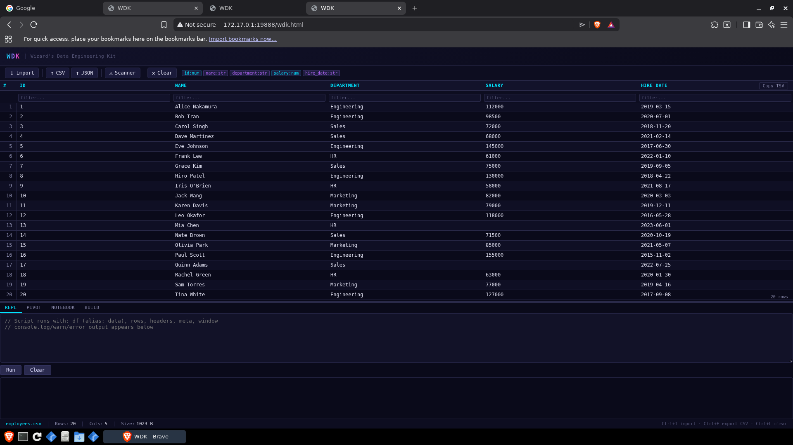
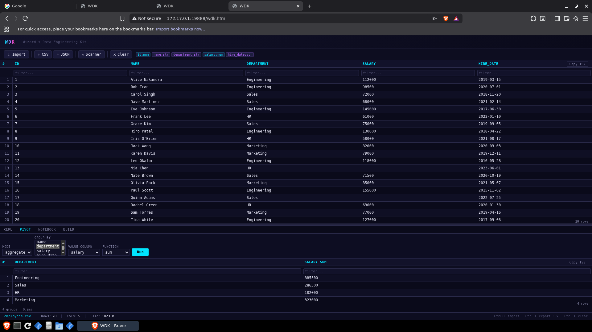
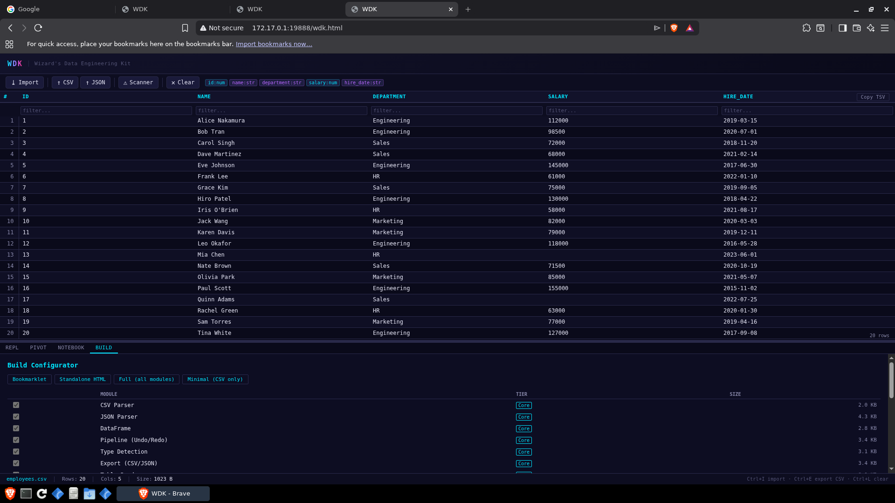

# Getting Started with WDK

WDK (Wizard's Data Engineering Kit) is a single HTML file that runs entirely in your browser — no installation, no network required, no admin rights. Load it from a USB drive, a SharePoint library, or a local folder.

## Step 1: Get the file

You need one file: `wdk.html` (about 191 KB).

- **From a colleague or shared drive:** Copy `wdk.html` to your desktop.
- **From a SharePoint library:** Open the file directly in your browser (no download needed).
- **From a USB drive:** Double-click `wdk.html`.

If you're building from source:

```bash
node build.js
# creates dist/wdk.html

# Or build a minimal bookmarklet (<100KB, CSV-only):
node build.js --tier=minimal
# creates dist/wdk-minimal.js, dist/wdk-minimal-bookmarklet.txt, dist/wdk-minimal.html
```

## Step 2: Open WDK

**Double-click `wdk.html`** — it opens in your default browser.

> **Tip:** If you need full features (clipboard access, large file handling), serve it from localhost instead. See the [Deployment Guide](deployment-guide.md) for a one-command PowerShell server.

You'll see the WDK app shell with tabs across the top: **Data, SQL, Pivot, Notebook, Build, Scanner, SharePoint**.

> **First time?** WDK shows onboarding hints on first use: empty-state messages in the REPL, Pivot, and Notebook panes guide you on what to do next, and tooltip hints highlight key shortcuts like **Ctrl+P** (command palette) and **Shift+Enter** (run cell). The Notebook tab opens with a **welcome template** containing 3 pre-populated cells to get you started.

## Step 3: Load a file

**Option A — Drag and drop:**
Drag any CSV, JSON, TSV, or XLSX file onto the drop zone in the Data tab.

**Option B — Click to browse:**
Click the file picker button in the Data tab and select your file.

**Supported formats:**
| Format | Notes |
|--------|-------|
| CSV | RFC 4180, auto-detects delimiter |
| TSV | Tab-separated |
| JSON | Arrays of objects; nested fields are flattened |
| XLSX | Excel files (all sheets, date serials auto-converted) |

Once loaded, WDK displays a scrollable table of your data with column headers detected automatically.



## Step 4: Explore your data

After loading a file, the **Data tab** shows your table. You can:

- **Sort** any column by clicking its header.
- **Filter** rows by typing in the filter box (simple text search).
- **Copy as TSV** — click the copy button to copy the visible table to clipboard for pasting into Excel.

The status bar shows row and column counts.

- **Select rows** by clicking a row. Use **Shift+click** to select a range. When rows are selected, a summary bar appears showing count, SUM, and AVG of numeric columns.
- **Command palette** — press **Ctrl+P** to open a fuzzy-search action list with 11 built-in actions (navigate tabs, toggle settings, export, etc.). Use arrow keys to navigate and Enter to select.

## Step 5: Run your first SQL query

Click the **SQL tab**.

Type a query in the input box and click **Run** (or press `Ctrl+Enter`):

```sql
SELECT *
FROM data
LIMIT 10
```

Your loaded file is always available as the table name `data`. If you load multiple files, each gets a name based on the filename.

More examples:

```sql
-- Filter and count
SELECT status, COUNT(*) AS total
FROM data
WHERE status != 'cancelled'
GROUP BY status
ORDER BY total DESC

-- Date math
SELECT name, hire_date, DATEDIFF(hire_date, TODAY()) AS days_employed
FROM data
WHERE YEAR(hire_date) >= 2020

-- Join two loaded files (load employees.csv and departments.csv first)
SELECT e.name, d.department_name
FROM employees AS e
LEFT JOIN departments AS d ON e.dept_id = d.id
```

See the [SQL Reference](sql-reference.md) for full function and syntax documentation.

## Step 6: Export results

After running a query, click **Export** to save the result:

- **Download CSV** — saves to your downloads folder
- **Copy to clipboard** — paste directly into Excel or another tool

## Step 7: Next steps



| What you want to do | Where to go |
|---------------------|-------------|
| Pivot / aggregate data | **Pivot tab** — pick group columns and aggregate functions |
| Write multi-step analysis | **Notebook tab** — mix SQL and JavaScript cells |
| Extract data from a web page | Use the **bookmarklet** mode — see [DOM Scraper / Network Interceptor Guide](inspect-guide.md) |
| Scan a file for PII or risks | **Scanner tab** |
| Connect to SharePoint lists | **SharePoint tab** — see [SharePoint Integration Guide](sharepoint-guide.md) |
| Deploy to a team | [Deployment Guide](deployment-guide.md) |



## Common questions

**Q: The file opened but nothing loads — I just see a blank page.**
Try a different browser (Chrome or Edge recommended). Firefox works too. Internet Explorer does not.

**Q: I get a "file could not be loaded" error with XLSX.**
XLSX support requires the Standalone or Full build tier. The bookmarklet build does not include XLSX. Use `wdk.html` (the standalone file), not the bookmarklet.

**Q: I loaded a CSV but the columns are all wrong.**
WDK auto-detects the delimiter. If your file uses semicolons or pipes, the auto-detection may misfire. You can use the SQL `REPLACE` function to clean up, or open the CSV in a text editor and confirm the delimiter.

**Q: Can I load more than one file at a time?**
Yes — drag multiple files onto the drop zone. Each file becomes a named table you can JOIN in SQL.

**Q: Does my data leave my machine?**
No. WDK runs entirely in your browser. No network calls are made. Your data never leaves the device.
