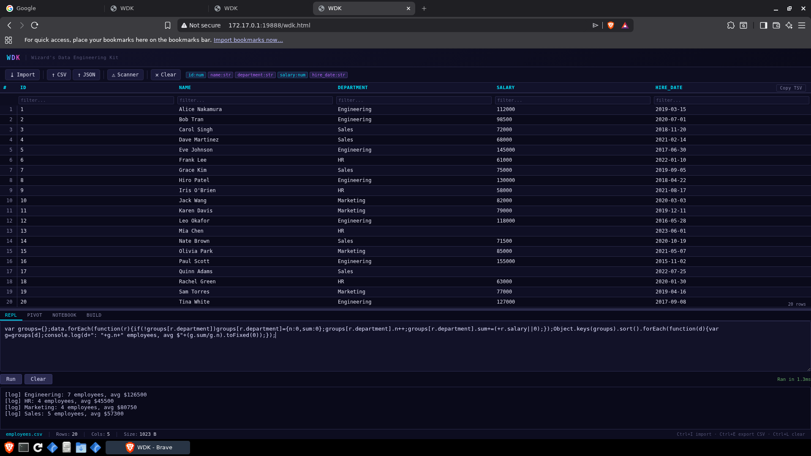
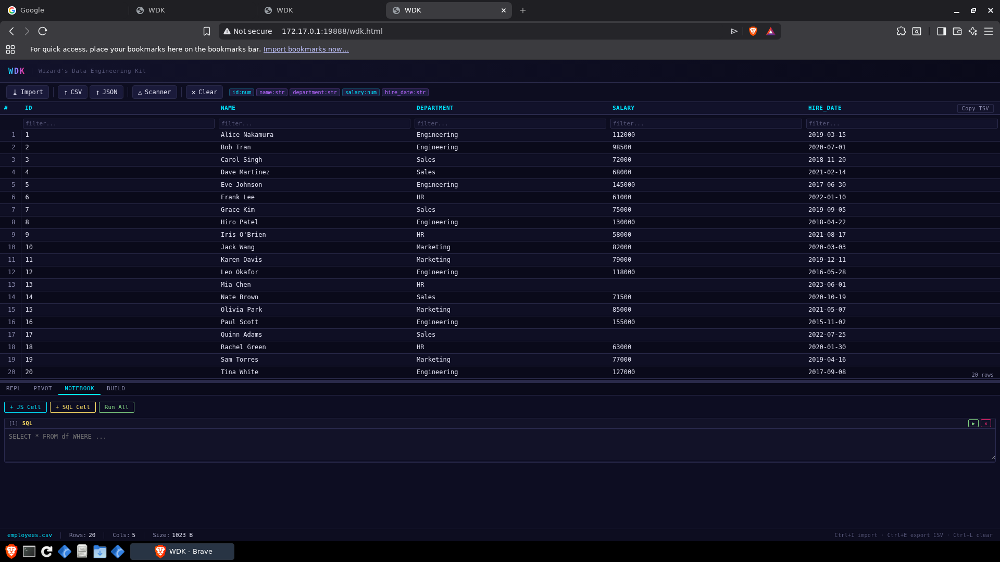

# REPL and Notebook Guide

WDK includes two scripting environments for working with your loaded data beyond what SQL alone can do: the **REPL** (interactive console) and the **Notebook** (multi-cell execution environment). Both give you direct access to your DataFrames and the full SQL engine.

## REPL — Interactive JavaScript Console

The REPL (Read-Eval-Print Loop) is a single-input script runner. Write JavaScript, press **Run** (or `Ctrl+Enter`), see the result. Good for quick one-off transforms, debugging column values, or doing math the SQL engine doesn't cover.

### Accessing the REPL

The REPL is available in the **Data tab** — look for the "Script" or "REPL" section below the table, or as a sub-tab depending on your build. It is included in Standalone and Full build tiers.

### Available variables

When your script runs, these variables are in scope:

| Variable | Type | Description |
|----------|------|-------------|
| `df` | DataFrame | The currently loaded dataset (alias: `data`) |
| `data` | object[] | Array of row objects — each row is `{ columnName: value, ... }` |
| `rows` | any[][] | Array of raw row arrays |
| `headers` | string[] | Column header names |
| `meta` | object | `{ rowCount, columnCount }` |
| `window` | Window | The browser window — access DOM, localStorage, etc. |

`console.log()`, `console.warn()`, and `console.error()` output appears in the output pane below the script.

### Basic examples

```javascript
// Count rows
console.log('Rows:', data.length);

// Inspect first row
console.log(data[0]);

// List unique values in a column
var statuses = [...new Set(data.map(r => r.status))];
console.log('Statuses:', statuses);

// Filter and count
var active = data.filter(r => r.status === 'active');
console.log('Active count:', active.length);

// Sum a numeric column
var total = data.reduce((sum, r) => sum + (parseFloat(r.revenue) || 0), 0);
console.log('Total revenue:', total.toFixed(2));
```

### Working with DataFrames

The `df` variable is a DataFrame object with methods you can chain:

```javascript
// Sort by a column
var sorted = df.sort('date', 'desc');

// Filter rows
var recent = df.filter(r => r.year >= 2024);

// Get column as array
var salaries = df.col('salary').map(Number);

// Deduplicate
var deduped = df.dedupe(['email']);

console.log('Unique email count:', deduped.rowCount);
```

### Transforming and exporting

```javascript
// Create a derived column (returns new array)
var withBonus = data.map(r => ({
  ...r,
  bonus: (parseFloat(r.salary) * 0.1).toFixed(2)
}));

// Output as CSV string (copy-paste into Excel)
var csv = [headers.join(',')]
  .concat(rows.map(r => r.map(v => JSON.stringify(v || '')).join(',')))
  .join('\n');
console.log(csv);
```



### Keyboard shortcuts

| Shortcut | Action |
|----------|--------|
| `Ctrl+Enter` | Run script |
| `Tab` | Insert 2 spaces (does not change focus) |

---

## Notebook — Multi-cell Execution Environment

The Notebook lets you build a reproducible analysis across multiple cells. Each cell is independently runnable. Cells can be JavaScript or SQL. Results appear inline below each cell.

### Accessing the Notebook

Click the **Notebook tab** in the WDK app shell.

### Cell types

**JS cells** run JavaScript with the same scope as the REPL (`df`, `data`, `rows`, `headers`, `meta`).

**SQL cells** run SQL queries against all loaded tables. The result renders as an inline table.

### Adding cells

- Click **+ JS Cell** to add a JavaScript cell
- Click **+ SQL Cell** to add a SQL cell
- Click **Run All** to execute every cell in order

Each cell has its own **Run** button. Click it (or press `Ctrl+Enter` inside the cell) to run just that cell.

### SQL cells

Type a query — your loaded tables are available by filename (without extension):

```sql
-- If you loaded employees.csv, the table is "employees"
SELECT department, AVG(salary) AS avg_salary, COUNT(*) AS headcount
FROM employees
GROUP BY department
ORDER BY avg_salary DESC
```

The result renders as a scrollable table below the cell. You can copy the result as TSV.

### JS cells

Write JavaScript against `df`, `data`, `rows`, `headers`:

```javascript
// Print a summary
var grouped = {};
data.forEach(r => {
  var key = r.department;
  grouped[key] = (grouped[key] || 0) + 1;
});
console.log('By department:', JSON.stringify(grouped, null, 2));
```

### Multi-step analysis example

A typical Notebook workflow looks like this:

**Cell 1 (SQL) — Load and filter:**
```sql
SELECT employee_id, name, department, salary, hire_date
FROM employees
WHERE status = 'active'
ORDER BY hire_date
```

**Cell 2 (SQL) — Aggregate:**
```sql
SELECT department,
  COUNT(*) AS headcount,
  ROUND(AVG(salary), 2) AS avg_salary,
  MIN(hire_date) AS earliest_hire
FROM employees
WHERE status = 'active'
GROUP BY department
ORDER BY headcount DESC
```

**Cell 3 (JS) — Custom logic:**
```javascript
// Compute 90th percentile salary (SQL doesn't have PERCENTILE yet)
var salaries = data.map(r => parseFloat(r.salary)).sort((a, b) => a - b);
var idx = Math.floor(salaries.length * 0.9);
console.log('90th percentile salary:', salaries[idx]);
```

**Cell 4 (JS) — Export:**
```javascript
// Build a summary report string
var lines = ['Department,Headcount,Avg Salary'];
data.forEach(r => {
  lines.push([r.department, r.headcount, r.avg_salary].join(','));
});
console.log(lines.join('\n'));
```



### Tips

- **Run All** is useful for reproducibility — run the whole notebook from scratch after loading fresh data.
- SQL cells and JS cells share the same data context. A SQL query result does not automatically update `df` — to chain SQL → JS, copy the output or re-structure as a JS cell using `execSQL`.
- Cell output is reset each time you run the cell.
- There is no autosave — if you close the tab, your notebook cells are lost. Copy important scripts to a text file.

### Keyboard shortcuts (Notebook)

| Shortcut | Action |
|----------|--------|
| `Ctrl+Enter` | Run current cell |
| `Tab` | Insert 2 spaces |
